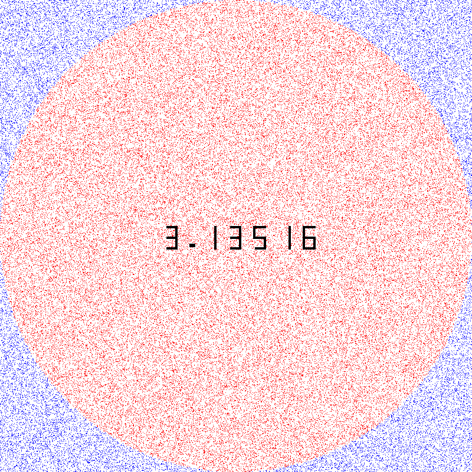

# PI Approximation using Monte Carlo Method

This Python project provides an approximation of the mathematical constant π (Pi) using the Monte Carlo method. The approximation improves as more points are added, which is visualized through an animated GIF.

## Overview

Monte Carlo methods are a class of algorithms that rely on repeated random sampling to obtain numerical results. In this case, we're approximating Pi by generating random points inside a square that encloses a quarter circle. By calculating the ratio of points that fall inside the quarter circle to the total number of points, we approximate the value of Pi.

## Features

- **Monte Carlo Approximation**: Efficiently approximates Pi by randomly sampling points.
- **Animated Visualization**: A generated GIF (`pi.gif`) visually demonstrates how the precision of the Pi approximation improves as the number of points increases.
- **Adjustable Precision**: Specify the number of decimal places of Pi that you want to approximate (up to 5).

## Usage

To run the program, use the following command:

```bash
 ./draw.py image_size number_of_points number_of_decimals
```
### Parameters:

- **image_size**: The size of the square image in pixels (e.g., 500).
- **number_of_points**: The number of random points to generate for the approximation (e.g., 10000).
- **number_of_decimals**: The number of decimal places for Pi approximation (must be between 1 and 5).

### Example:

```bash
$ ./draw.py 500 10000 3
```

This will generate an approximation of Pi to 3 decimal places using 10,000 random points within a 500x500 image.

### Visualization

The project includes a GIF (`pi.gif`) which demonstrates how the Pi approximation converges with an increasing number of points. The precision improves as more points are added, showing the gradual refinement of the approximation.

Here's a preview of the generated visualization:



